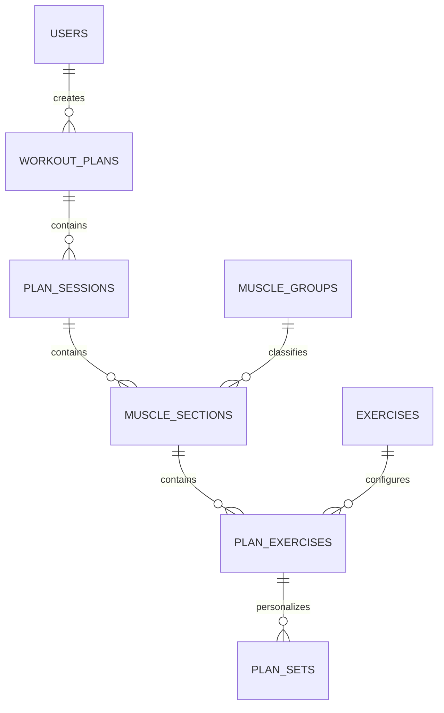
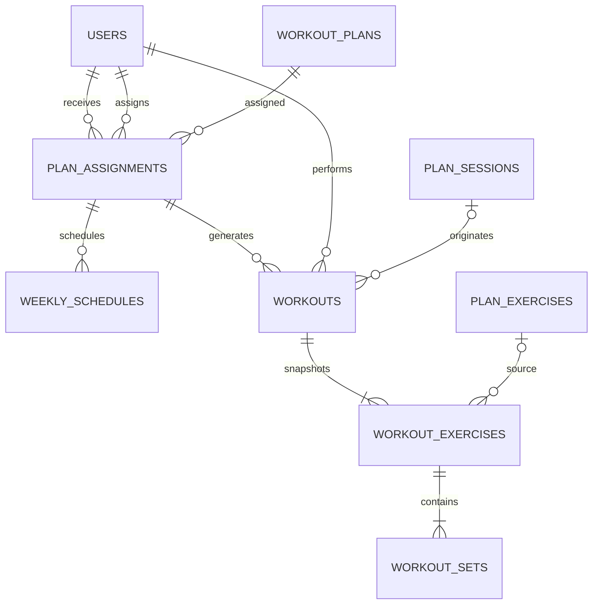

# GymPlanner - Specifica completa per sviluppo backend e frontend

Versione 4.0 - 24 settembre 2026  
Stato: fonte di verità per analisi tecnica e sviluppo incrementale  
Lingua della documentazione: italiano  
Lingua di codice, classi, API e database: inglese

---

## 0. Istruzioni obbligatorie per Claude Code

Leggi integralmente questo documento prima di creare o modificare file.

Agisci come Senior Software Engineer Java/Spring Boot e React. Devi costruire
l'applicazione descritta qui, un incremento e una user story alla volta.

Regole operative:

1. Questo documento è la fonte di verità funzionale e tecnica.
2. Non introdurre requisiti non presenti senza segnalarli come proposta.
3. Se trovi un conflitto, fermati, indica i punti coinvolti e chiedi una decisione.
4. Prima di ogni incremento presenta:
   - obiettivo;
   - user story incluse;
   - file da creare o modificare;
   - migrazioni database;
   - endpoint;
   - pagine frontend;
   - test previsti.
5. Attendi approvazione prima di iniziare un nuovo incremento.
6. Prima di ogni user story presenta un piano breve; dopo l'approvazione implementa
   codice completo, migrazioni, test e documentazione.
7. Non sviluppare elementi marcati `FUTURO`.
8. Non oltrepassare un punto marcato `DECISIONE APERTA` senza chiedere conferma.
9. Architettura obbligatoria: monolite modulare, non microservizi.
10. Backend e frontend devono trovarsi nello stesso repository, in directory separate.
11. Il database si evolve solo mediante migrazioni Flyway. Vietato usare
    `ddl-auto=update`, `create` o `create-drop` negli ambienti ordinari.
12. Le entità JPA non devono uscire dai controller: usare DTO distinti.
13. Ogni autorizzazione deve essere verificata lato backend; il frontend non è un confine di sicurezza.
14. Ogni endpoint `/api/me/**` deve ricavare lo USER dalla sessione autenticata,
    mai da `userId` ricevuto dal client.
15. Non modificare una migrazione Flyway già applicata: crearne sempre una nuova.
16. Non implementare tutto in un solo passaggio. Procedere nell'ordine della sezione 18.
17. Dopo ogni user story eseguire test automatici, build backend e build frontend.
18. Alla fine di ogni incremento consegnare un riepilogo delle funzionalità verificabili manualmente.

Primo messaggio atteso da Claude Code dopo la lettura:

1. riassunto del prodotto in massimo 12 punti;
2. elenco delle decisioni aperte che bloccano l'incremento corrente;
3. proposta della struttura del repository;
4. piano dell'Incremento 0;
5. nessun codice finché il proprietario non approva il piano.

---

## 1. Visione del prodotto

GymPlanner è una web app amministrata per creare e assegnare schede di
allenamento in palestra.

Non esiste registrazione pubblica. L'ADMIN crea gli account USER, gestisce il
catalogo degli esercizi, costruisce le schede e assegna la stessa scheda a uno o
più utenti.

Lo USER:

- accede con l'account ricevuto;
- visualizza una o più schede assegnate;
- ha al massimo una scheda attiva;
- sceglie i giorni settimanali nei quali si allena;
- riceve automaticamente le sessioni della scheda in rotazione;
- svolge l'allenamento serie per serie;
- usa il timer di recupero;
- può completare serie e saltare esercizi;
- consulta uno storico essenziale.

L'applicazione è divisa concettualmente in due aree:

### Area ADMIN

- gestione account;
- gestione cataloghi;
- creazione e modifica delle schede;
- configurazione di sessioni, sezioni, esercizi e serie;
- assegnazione delle schede;
- attivazione e chiusura delle assegnazioni.

### Area USER

- visualizzazione delle schede assegnate;
- selezione dei giorni di allenamento;
- calendario;
- esecuzione guidata;
- timer;
- storico essenziale;
- profilo e cambio password.

---

## 2. Ambito della prima versione

La prima versione deve includere:

- bootstrap sicuro del primo ADMIN;
- login, logout e cambio password obbligatorio al primo accesso;
- gestione account USER da parte dell'ADMIN;
- gestione gruppi muscolari ed esercizi;
- creazione, duplicazione, modifica, eliminazione logica e ripristino schede;
- sessioni della scheda;
- sezioni muscolari;
- esercizi configurati;
- serie, ripetizioni, allenamento a cedimento e recupero;
- serie personalizzate;
- assegnazione di una scheda a uno o più utenti;
- una sola assegnazione attiva per USER;
- selezione dei giorni settimanali;
- rotazione automatica delle sessioni;
- vista dell'allenamento odierno;
- esecuzione persistente;
- timer di recupero;
- esercizi completati e saltati;
- storico essenziale;
- interfaccia responsive e accessibile.

Non rientrano nella prima versione:

- pesi previsti e realmente usati;
- ripetizioni realmente effettuate;
- statistiche e grafici;
- record personali;
- durata aggregata;
- RPE e RIR;
- superset, circuiti e drop set;
- foto e video;
- notifiche push;
- PWA e applicazione mobile nativa;
- recupero password tramite email;
- sessioni eccezionali fuori calendario;
- microservizi;
- code di messaggi;
- cache distribuite.

---

## 3. Ruoli e permessi

| Funzione | ADMIN | USER |
| --- | ---: | ---: |
| Login e logout | sì | sì |
| Creare account USER | sì | no |
| Modificare, attivare e disattivare account | sì | no |
| Resettare password USER | sì | no |
| Gestire gruppi muscolari | sì | no |
| Gestire esercizi | sì | no |
| Creare e modificare schede | sì | no |
| Duplicare schede | sì | no |
| Eliminare logicamente e ripristinare schede | sì | no |
| Assegnare schede | sì | no |
| Vedere tutte le schede | sì | no |
| Vedere schede assegnate | sì | sì, solo le proprie |
| Scegliere i giorni settimanali | no | sì |
| Avviare un allenamento | no | sì |
| Completare serie | no | sì |
| Saltare esercizi | no | sì |
| Consultare storico | futuro | sì, solo il proprio |
| Modificare telefono e password personali | sì | sì |

Regole:

- il ruolo non è selezionabile durante la creazione di un account USER;
- l'interfaccia ordinaria non crea altri ADMIN;
- nessuno USER può chiamare endpoint amministrativi;
- uno USER non può conoscere l'esistenza delle risorse appartenenti ad altri utenti;
- per risorse inesistenti o non autorizzate restituire lo stesso `404`.

---

## 4. Decisioni funzionali vincolanti

1. Nessuna registrazione pubblica.
2. Gli account USER sono creati dall'ADMIN.
3. Solo l'ADMIN gestisce cataloghi e schede.
4. Lo USER vede esclusivamente le schede assegnate.
5. Una scheda può essere assegnata a più utenti.
6. Un utente può ricevere più schede nel tempo.
7. Ogni USER ha al massimo una sola assegnazione attiva.
8. Le modifiche a una scheda condivisa valgono per tutti gli assegnatari futuri e
   per gli allenamenti non ancora avviati.
9. Gli allenamenti già avviati o conclusi non cambiano, perché usano uno snapshot.
10. Per personalizzare una scheda per un singolo utente, l'ADMIN la duplica.
11. Lo USER sceglie soltanto i giorni della settimana.
12. Lo USER non associa manualmente una sessione a un giorno.
13. Le sessioni vengono distribuite ciclicamente nell'ordine stabilito dall'ADMIN.
14. Una giornata pianificata consuma la propria sessione anche se non viene svolta,
    salvo futura decisione contraria indicata nella sezione 17.
15. Il timer parte quando viene premuto `Fine serie`.
16. Il recupero deriva dalla serie configurata o dal valore generale dell'esercizio.
17. Recupero `0` significa nessun timer.
18. Gli esercizi in esecuzione hanno stato `TODO`, `IN_PROGRESS`, `COMPLETED`, `SKIPPED`.
19. Le serie completate e gli esercizi saltati vengono salvati.
20. Lo storico essenziale fa parte della prima versione.
21. Lo storico avanzato resta futuro.
22. Le schede e i cataloghi usano cancellazione logica.
23. I figli interni della scheda possono essere eliminati fisicamente, perché lo storico è protetto dagli snapshot.
24. Il telefono dello USER è facoltativo.
25. Le serie personalizzate, se presenti, coprono tutte le serie da 1 a N senza buchi.

---

## 5. Stack tecnologico

### Backend

- Java 21 LTS;
- Spring Boot in una versione stabile compatibile con Java 21, fissata nel `pom.xml`;
- Maven Wrapper;
- Spring Web;
- Spring Security;
- Spring Data JPA;
- Bean Validation;
- PostgreSQL Driver;
- Flyway;
- Actuator limitato agli endpoint necessari;
- Testcontainers per test di integrazione;
- JUnit 5, Mockito e MockMvc;
- ArchUnit oppure Spring Modulith per verificare i confini modulari.

### Frontend

- React;
- TypeScript in modalità strict;
- Vite;
- React Router;
- TanStack Query;
- React Hook Form;
- una libreria di validazione coerente, preferibilmente Zod;
- CSS modulare oppure un sistema coerente deciso all'avvio;
- test con Vitest e React Testing Library;
- Playwright per pochi flussi end-to-end critici.

### Database e infrastruttura locale

- PostgreSQL;
- Docker Compose per il solo ambiente locale;
- migrazioni Flyway versionate;
- date e orari salvati in UTC tramite `timestamptz`;
- date di calendario salvate come `date` senza fuso;
- UUID generati dal backend.

---

## 6. Architettura

### 6.1 Monolite modulare

Moduli backend:

| Modulo | Responsabilità |
| --- | --- |
| `identity` | login, account, ruoli, profilo, blocco tentativi |
| `catalog` | gruppi muscolari ed esercizi |
| `workoutplan` | schede e struttura configurabile |
| `assignment` | assegnazioni USER-scheda |
| `calendar` | giorni settimanali e rotazione |
| `execution` | allenamenti, serie e storico essenziale |
| `shared` | errori, tempo, configurazione tecnica, utilità non di dominio |

Dipendenze ammesse:

```text
workoutplan -> catalog
assignment  -> identity, workoutplan
calendar    -> assignment, workoutplan
execution   -> calendar, assignment, workoutplan
```

Regole:

- nessuna dipendenza circolare;
- un modulo non usa direttamente il repository di un altro modulo;
- ogni modulo espone solo servizi e DTO nel proprio package `api`;
- i package `internal` non devono essere importati dagli altri moduli;
- le transazioni che coinvolgono più moduli vengono orchestrate da un application service esplicito.

### 6.2 Struttura repository consigliata

```text
gym-planner/
├── README.md
├── compose.yaml
├── .env.example
├── docs/
│   ├── architecture.md
│   ├── api.md
│   └── decisions/
├── backend/
│   ├── pom.xml
│   ├── mvnw
│   ├── mvnw.cmd
│   └── src/
│       ├── main/
│       │   ├── java/com/gymplanner/
│       │   │   ├── GymPlannerApplication.java
│       │   │   ├── identity/
│       │   │   ├── catalog/
│       │   │   ├── workoutplan/
│       │   │   ├── assignment/
│       │   │   ├── calendar/
│       │   │   ├── execution/
│       │   │   └── shared/
│       │   └── resources/
│       │       ├── application.properties
│       │       └── db/migration/
│       └── test/
└── frontend/
    ├── package.json
    ├── vite.config.ts
    ├── tsconfig.json
    └── src/
        ├── app/
        ├── auth/
        ├── admin/
        ├── user/
        ├── features/
        ├── shared/
        └── test/
```

Il progetto usa `application.properties`, non YAML.

---

## 7. Glossario e nomi ufficiali

| Italiano | Classe Java | Tabella |
| --- | --- | --- |
| Utente | `User` | `users` |
| Gruppo muscolare | `MuscleGroup` | `muscle_groups` |
| Esercizio di catalogo | `Exercise` | `exercises` |
| Scheda | `WorkoutPlan` | `workout_plans` |
| Sessione scheda | `PlanSession` | `plan_sessions` |
| Sezione muscolare | `MuscleSection` | `muscle_sections` |
| Esercizio configurato | `PlanExercise` | `plan_exercises` |
| Serie personalizzata | `PlanSet` | `plan_sets` |
| Assegnazione | `PlanAssignment` | `plan_assignments` |
| Giorno settimanale | `WeeklySchedule` | `weekly_schedules` |
| Allenamento | `Workout` | `workouts` |
| Esercizio allenamento | `WorkoutExercise` | `workout_exercises` |
| Serie allenamento | `WorkoutSet` | `workout_sets` |

Il termine `PlanSession` indica una sessione della scheda. Non usare `Session`
da solo per evitare confusione con la sessione HTTP.

---

## 8. Modello delle entità e relazioni

### 8.1 Configurazione della scheda



Le cardinalità dei figli sono opzionali durante la modifica. Una scheda vuota può
esistere, ma non è eseguibile.

### 8.2 Assegnazione ed esecuzione



Non usare `@ManyToMany` diretto fra `User` e `WorkoutPlan`.
`PlanAssignment` è un'entità vera perché possiede date, stato e dati della rotazione.

### 8.3 Entità `User`

| Campo | Tipo logico | Vincoli |
| --- | --- | --- |
| `id` | UUID | PK |
| `firstName` | String(80) | obbligatorio |
| `lastName` | String(80) | obbligatorio |
| `username` | String(50) | obbligatorio, univoco case-insensitive |
| `email` | String(254) | obbligatorio, univoco case-insensitive |
| `phone` | String(30) | facoltativo |
| `passwordHash` | String(255) | obbligatorio, mai esposto |
| `role` | `UserRole` | `ADMIN`, `USER` |
| `active` | boolean | default true |
| `mustChangePassword` | boolean | true per account creati o resettati |
| `failedLoginCount` | int | default 0 |
| `lockedUntil` | Instant | facoltativo |
| `createdAt` | Instant | generato |
| `updatedAt` | Instant | generato |

Tabella `users`, non `user`, perché `user` è una parola riservata PostgreSQL.

### 8.4 Entità di catalogo

`MuscleGroup` e `Exercise`:

| Campo | Tipo logico | Vincoli |
| --- | --- | --- |
| `id` | UUID | PK |
| `name` | String(100) | obbligatorio, univoco case-insensitive |
| `active` | boolean | default true |
| `createdAt` | Instant | generato |
| `updatedAt` | Instant | generato |

Un elemento disattivato non è selezionabile in nuove configurazioni, ma rimane
visibile nelle schede che lo utilizzano.

### 8.5 Entità `WorkoutPlan`

| Campo | Tipo logico | Vincoli |
| --- | --- | --- |
| `id` | UUID | PK |
| `name` | String(100) | obbligatorio |
| `description` | Text | facoltativo |
| `expiresOn` | LocalDate | facoltativo, informativo |
| `createdBy` | User | ADMIN obbligatorio |
| `copiedFromPlan` | WorkoutPlan | facoltativo |
| `createdAt` | Instant | generato |
| `updatedAt` | Instant | generato |
| `deletedAt` | Instant | null = attiva |
| `version` | long | optimistic locking consigliato |

La scheda è eseguibile solo se:

- non è eliminata;
- contiene almeno una sessione;
- ogni sessione contiene almeno un esercizio valido;
- ogni esercizio ha una configurazione coerente.

### 8.6 Entità `PlanSession`

| Campo | Tipo logico | Vincoli |
| --- | --- | --- |
| `id` | UUID | PK |
| `workoutPlan` | WorkoutPlan | obbligatorio |
| `title` | String(60) | obbligatorio |
| `position` | int | maggiore di 0 |

Vincolo unico: `(workout_plan_id, position)`.

### 8.7 Entità `MuscleSection`

| Campo | Tipo logico | Vincoli |
| --- | --- | --- |
| `id` | UUID | PK |
| `planSession` | PlanSession | obbligatorio |
| `muscleGroup` | MuscleGroup | obbligatorio |
| `position` | int | maggiore di 0 |

Vincoli unici:

- `(plan_session_id, position)`;
- `(plan_session_id, muscle_group_id)`.

### 8.8 Entità `PlanExercise`

| Campo | Tipo logico | Vincoli |
| --- | --- | --- |
| `id` | UUID | PK |
| `muscleSection` | MuscleSection | obbligatorio |
| `exercise` | Exercise | obbligatorio |
| `position` | int | maggiore di 0 |
| `setsCount` | int | da 1 a 20 |
| `reps` | int | da 0 a 100 |
| `toFailure` | boolean | default false |
| `restSeconds` | int | da 0 a 600 |

Check:

```text
(to_failure = true  AND reps = 0)
OR
(to_failure = false AND reps BETWEEN 1 AND 100)
```

Non inserire il campo `customSets`: la personalizzazione si ricava dalla presenza
delle righe in `plan_sets`.

### 8.9 Entità `PlanSet`

| Campo | Tipo logico | Vincoli |
| --- | --- | --- |
| `id` | UUID | PK |
| `planExercise` | PlanExercise | obbligatorio |
| `setIndex` | int | da 1 a `setsCount` |
| `reps` | int | da 0 a 100 |
| `toFailure` | boolean | default false |
| `restSeconds` | int | da 0 a 600 |

Vincolo unico: `(plan_exercise_id, set_index)`.

Regola tutto-o-niente:

- zero righe: usare i valori generali di `PlanExercise`;
- altrimenti devono esistere esattamente `setsCount` righe con indici da 1 a N;
- la sostituzione delle serie personalizzate avviene in una singola transazione.

### 8.10 Entità `PlanAssignment`

| Campo | Tipo logico | Vincoli |
| --- | --- | --- |
| `id` | UUID | PK |
| `user` | User | deve avere ruolo USER |
| `workoutPlan` | WorkoutPlan | obbligatorio |
| `assignedBy` | User | deve avere ruolo ADMIN |
| `startDate` | LocalDate | obbligatorio |
| `endDate` | LocalDate | facoltativo |
| `active` | boolean | default false |
| `rotationAnchorDate` | LocalDate | valorizzata all'attivazione |
| `rotationAnchorIndex` | int | indice sessione iniziale |
| `createdAt` | Instant | generato |

Vincoli:

- indice unico parziale su `user_id` dove `active = true`;
- `end_date` non può precedere `start_date`;
- se `active = true`, `end_date` deve essere null;
- chiudere un'assegnazione imposta `active = false` e `end_date`;
- non creare due assegnazioni attive della stessa scheda per lo stesso USER.

### 8.11 Entità `WeeklySchedule`

| Campo | Tipo logico | Vincoli |
| --- | --- | --- |
| `id` | UUID | PK |
| `planAssignment` | PlanAssignment | obbligatorio |
| `weekday` | int | ISO 1=lunedì, 7=domenica |

Vincolo unico: `(plan_assignment_id, weekday)`.

Non contiene `planSessionId`: la sessione viene calcolata dalla rotazione.

### 8.12 Entità `Workout`

| Campo | Tipo logico | Vincoli |
| --- | --- | --- |
| `id` | UUID | PK |
| `user` | User | obbligatorio |
| `planAssignment` | PlanAssignment | obbligatorio |
| `planSession` | PlanSession | facoltativo, `ON DELETE SET NULL` |
| `scheduledDate` | LocalDate | obbligatorio |
| `startedAt` | Instant | obbligatorio |
| `finishedAt` | Instant | facoltativo |
| `status` | `WorkoutStatus` | obbligatorio |
| `planNameSnapshot` | String(100) | obbligatorio |
| `sessionTitleSnapshot` | String(60) | obbligatorio |

Vincoli:

- unico `(plan_assignment_id, scheduled_date)`;
- indice unico parziale su `user_id` dove status = `IN_PROGRESS`;
- `finishedAt` obbligatorio per `COMPLETED` e `INTERRUPTED`;
- lo snapshot è immutabile dopo l'avvio.

### 8.13 Entità `WorkoutExercise`

| Campo | Tipo logico | Vincoli |
| --- | --- | --- |
| `id` | UUID | PK |
| `workout` | Workout | obbligatorio |
| `planExercise` | PlanExercise | facoltativo, `ON DELETE SET NULL` |
| `position` | int | ordine globale nella sessione |
| `status` | `WorkoutExerciseStatus` | obbligatorio |
| `exerciseNameSnapshot` | String(100) | obbligatorio |
| `muscleGroupNameSnapshot` | String(100) | obbligatorio |
| `setsPlanned` | int | da 1 a 20 |

Vincoli:

- unico `(workout_id, position)`;
- al massimo un esercizio `IN_PROGRESS` per allenamento.

### 8.14 Entità `WorkoutSet`

| Campo | Tipo logico | Vincoli |
| --- | --- | --- |
| `id` | UUID | PK |
| `workoutExercise` | WorkoutExercise | obbligatorio |
| `setIndex` | int | da 1 a `setsPlanned` |
| `repsPlanned` | int | da 0 a 100 |
| `toFailure` | boolean | obbligatorio |
| `restSeconds` | int | da 0 a 600 |
| `completedAt` | Instant | null = non completata |

Vincolo unico: `(workout_exercise_id, set_index)`.

Non aggiungere un booleano `completed`: lo stato si ricava da `completedAt`.

---

## 9. Enum

```text
UserRole
- ADMIN
- USER

WorkoutStatus
- IN_PROGRESS
- COMPLETED
- INTERRUPTED

WorkoutExerciseStatus
- TODO
- IN_PROGRESS
- COMPLETED
- SKIPPED
```

Persistenza consigliata: stringa, non ordinali numerici.

---

## 10. Regole di business

### 10.1 Creazione del primo ADMIN

All'avvio:

1. verificare se esiste almeno un ADMIN;
2. se esiste, non fare nulla;
3. se non esiste, leggere username, email e password iniziale da variabili d'ambiente;
4. se una variabile manca, interrompere l'avvio con un messaggio chiaro;
5. creare l'ADMIN con `mustChangePassword = true`;
6. non creare endpoint pubblici per registrare ADMIN.

Variabili suggerite:

```text
GYM_ADMIN_USERNAME
GYM_ADMIN_EMAIL
GYM_ADMIN_PASSWORD
```

Non stampare la password nei log.

### 10.2 Cataloghi

- i nomi sono univoci senza distinzione fra maiuscole e minuscole;
- gli elementi si disattivano, non si cancellano se già referenziati;
- disattivare non modifica le schede esistenti;
- solo elementi attivi possono essere inseriti in nuove configurazioni.

### 10.3 Schede condivise

- una scheda non appartiene direttamente a un singolo USER;
- `createdBy` indica l'ADMIN autore;
- prima di modificare una scheda mostrare quanti assegnatari attivi sono coinvolti;
- gli allenamenti già avviati restano immutati;
- duplicare crea una copia profonda di sessioni, sezioni, esercizi e serie;
- la copia non eredita assegnazioni;
- `copiedFromPlan` conserva la provenienza.

### 10.4 Cancellazioni

- `User`: disattivazione tramite `active`, nessuna cancellazione fisica ordinaria;
- `WorkoutPlan`: `deletedAt`, ripristinabile;
- `MuscleGroup` ed `Exercise`: `active`, ripristinabili;
- figli interni della scheda: cancellazione fisica ammessa con conferma;
- `Workout` e snapshot non devono essere cancellati dalle normali operazioni;
- FK di origine nello storico usano `ON DELETE SET NULL`.

### 10.5 Attivazione assegnazione

In una singola transazione:

1. validare USER, scheda ed eseguibilità;
2. chiudere l'eventuale assegnazione attiva precedente;
3. interrompere l'eventuale allenamento in corso collegato alla precedente;
4. attivare la nuova assegnazione;
5. inizializzare l'ancoraggio di rotazione;
6. se confermato, copiare i giorni settimanali della precedente assegnazione.

### 10.6 Rotazione delle sessioni

Dati:

- `W`: giorni settimanali scelti;
- `S[0..N-1]`: sessioni ordinate;
- `a`: `rotationAnchorDate`;
- `i0`: `rotationAnchorIndex`.

Per una data `d`:

1. se l'assegnazione non è attiva nel periodo, nessuna sessione;
2. se `W` è vuoto oppure `N = 0`, nessuna sessione;
3. se il giorno della settimana di `d` non è in `W`, giorno di riposo;
4. calcolare `k`, numero di giornate pianificate comprese fra `a` inclusa e `d` esclusa;
5. sessione = `S[(i0 + k) mod N]`.

Esempio:

```text
Sessioni: Giorno 1, Giorno 2
Giorni: lunedì, mercoledì, venerdì

Lunedì 1    -> Giorno 1
Mercoledì 3 -> Giorno 2
Venerdì 5   -> Giorno 1
Lunedì 8    -> Giorno 2
```

Il calcolo deve essere efficiente: settimane intere moltiplicate per il numero
dei giorni scelti, più il resto. Non iterare giorno per giorno su intervalli lunghi.

Ri-ancorare quando:

- lo USER cambia giorni;
- l'ADMIN aggiunge, elimina o riordina sessioni;
- una nuova assegnazione viene attivata.

Il ri-ancoraggio non deve modificare retroattivamente allenamenti esistenti.

### 10.7 Avvio allenamento e snapshot

L'avvio è una sola transazione:

1. verificare autenticazione e assegnazione;
2. verificare data pianificata;
3. verificare scheda eseguibile;
4. impedire duplicato per assegnazione e data;
5. impedire più allenamenti in corso per lo stesso USER;
6. creare `Workout`;
7. ordinare globalmente gli esercizi per posizione sessione, sezione ed esercizio;
8. creare tutti i `WorkoutExercise`;
9. creare tutti i `WorkoutSet` usando `PlanSet`, oppure i valori generali;
10. impostare il primo esercizio `IN_PROGRESS` e gli altri `TODO`;
11. restituire lo stato completo dell'allenamento.

Dopo lo snapshot, l'esecuzione non deve più leggere la configurazione per decidere
nomi, serie, ripetizioni o recuperi.

### 10.8 Fine serie

- il client invia l'id preciso di `WorkoutSet`;
- l'operazione deve essere idempotente;
- completare una serie già completata restituisce lo stato corrente senza avanzare due volte;
- valorizzare `completedAt` usando l'orario server;
- se restano serie, conservare l'esercizio `IN_PROGRESS`;
- se era l'ultima serie, impostare l'esercizio `COMPLETED`;
- attivare il successivo esercizio `TODO`, se esiste;
- se non esiste, completare il `Workout` e valorizzare `finishedAt`.

### 10.9 Timer

Il timer non è un'entità database.

```text
restEndsAt = completedAt + restSeconds
```

Ogni risposta di esecuzione deve includere:

- `serverTime`;
- `restEndsAt`, se applicabile;
- stato completo dell'allenamento;
- prossima azione consentita.

Il frontend calcola il tempo residuo dalla differenza fra istanti. Non deve
decrementare ciecamente un contatore. Al ritorno in primo piano usa
`visibilitychange` per riallinearsi.

Limite noto: audio e vibrazione non sono garantiti a schermo bloccato.

### 10.10 Saltare esercizio

- solo l'esercizio `IN_PROGRESS` può essere saltato;
- richiedere conferma;
- impostare `SKIPPED`;
- conservare eventuali serie già completate;
- attivare il successivo esercizio;
- se non esiste un successivo, completare l'allenamento;
- mostrare `SKIPPED` nello storico.

---

## 11. Sicurezza e autenticazione

Scelta consigliata per SPA servita sullo stesso dominio:

- sessione server Spring Security;
- cookie `HttpOnly`;
- cookie `Secure` in produzione;
- `SameSite=Lax`;
- protezione CSRF attiva;
- CORS limitato all'origine frontend prevista;
- password con BCrypt o Argon2;
- scadenza per inattività iniziale: 60 minuti;
- blocco iniziale: 15 minuti dopo 5 tentativi falliti;
- messaggio di login generico;
- invalidazione delle sessioni quando l'account viene disattivato o la password resettata;
- nessun hash, cookie, token o credenziale nei log;
- segreti solo in variabili d'ambiente;
- `.env` escluso da Git;
- `.env.example` privo di segreti reali.

Se `mustChangePassword = true`, consentire soltanto:

- login;
- logout;
- informazioni utente corrente;
- cambio password.

Gli altri endpoint rispondono `403` con codice applicativo
`PASSWORD_CHANGE_REQUIRED`.

---

## 12. Contratto degli errori

Usare Problem Details compatibile RFC 9457.

Esempio validazione:

```json
{
  "type": "https://gymplanner/errors/validation",
  "title": "Validation failed",
  "status": 400,
  "detail": "One or more fields are invalid",
  "instance": "/api/admin/users",
  "code": "VALIDATION_ERROR",
  "errors": [
    { "field": "email", "message": "Email is already in use" }
  ]
}
```

Codici HTTP:

| Codice | Uso |
| ---: | --- |
| 200 | lettura o aggiornamento riuscito |
| 201 | risorsa creata |
| 204 | azione riuscita senza corpo |
| 400 | validazione sintattica o campi non validi |
| 401 | sessione assente o scaduta |
| 403 | ruolo insufficiente o cambio password richiesto |
| 404 | risorsa inesistente o non accessibile |
| 409 | duplicato o conflitto di concorrenza/stato |
| 422 | azione incompatibile con lo stato del dominio |

---

## 13. API REST

Prefisso: `/api`.

### 13.1 Autenticazione e profilo

| Metodo | Endpoint | Accesso | Funzione |
| --- | --- | --- | --- |
| POST | `/api/auth/login` | pubblico | login |
| POST | `/api/auth/logout` | autenticato | logout |
| GET | `/api/auth/me` | autenticato | utente corrente |
| POST | `/api/auth/change-password` | autenticato | cambio password |
| GET | `/api/me/profile` | autenticato | profilo |
| PUT | `/api/me/profile` | autenticato | telefono e campi consentiti |

### 13.2 Account ADMIN

| Metodo | Endpoint | Funzione |
| --- | --- | --- |
| GET | `/api/admin/users` | elenco paginato e ricerca |
| POST | `/api/admin/users` | crea USER |
| GET | `/api/admin/users/{id}` | dettaglio |
| PUT | `/api/admin/users/{id}` | modifica dati |
| POST | `/api/admin/users/{id}/activate` | riattiva |
| POST | `/api/admin/users/{id}/deactivate` | disattiva |
| POST | `/api/admin/users/{id}/reset-password` | password temporanea |
| GET | `/api/admin/users/{id}/assignments` | assegnazioni utente |

### 13.3 Cataloghi ADMIN

| Metodo | Endpoint | Funzione |
| --- | --- | --- |
| GET, POST | `/api/admin/muscle-groups` | cerca/elenca e crea |
| PUT | `/api/admin/muscle-groups/{id}` | modifica |
| POST | `/api/admin/muscle-groups/{id}/activate` | riattiva |
| POST | `/api/admin/muscle-groups/{id}/deactivate` | disattiva |
| GET, POST | `/api/admin/exercises` | cerca/elenca e crea |
| PUT | `/api/admin/exercises/{id}` | modifica |
| POST | `/api/admin/exercises/{id}/activate` | riattiva |
| POST | `/api/admin/exercises/{id}/deactivate` | disattiva |

### 13.4 Schede ADMIN

| Metodo | Endpoint | Funzione |
| --- | --- | --- |
| GET | `/api/admin/plans` | elenco e filtro eliminate |
| POST | `/api/admin/plans` | crea scheda |
| GET | `/api/admin/plans/{id}` | struttura completa |
| PUT | `/api/admin/plans/{id}` | metadati scheda |
| DELETE | `/api/admin/plans/{id}` | eliminazione logica |
| POST | `/api/admin/plans/{id}/restore` | ripristino |
| POST | `/api/admin/plans/{id}/duplicate` | copia profonda |
| POST | `/api/admin/plans/{id}/sessions` | aggiunge sessione |
| PUT | `/api/admin/sessions/{id}` | rinomina sessione |
| DELETE | `/api/admin/sessions/{id}` | elimina sessione |
| PUT | `/api/admin/plans/{id}/sessions/order` | riordino atomico |
| POST | `/api/admin/sessions/{id}/sections` | aggiunge sezione |
| DELETE | `/api/admin/sections/{id}` | elimina sezione |
| PUT | `/api/admin/sessions/{id}/sections/order` | riordina sezioni |
| POST | `/api/admin/sections/{id}/exercises` | aggiunge esercizio configurato |
| PUT | `/api/admin/plan-exercises/{id}` | aggiorna configurazione completa |
| DELETE | `/api/admin/plan-exercises/{id}` | elimina configurazione |
| PUT | `/api/admin/sections/{id}/exercises/order` | riordina esercizi |

I riordini ricevono tutti gli id del contenitore nel nuovo ordine e vengono
salvati in una singola transazione.

### 13.5 Assegnazioni ADMIN

| Metodo | Endpoint | Funzione |
| --- | --- | --- |
| GET | `/api/admin/plans/{id}/assignments` | assegnatari della scheda |
| POST | `/api/admin/assignments` | assegna a uno o più USER |
| POST | `/api/admin/assignments/{id}/activate` | rende attiva |
| POST | `/api/admin/assignments/{id}/close` | chiude |

Richiesta assegnazione multipla:

```json
{
  "planId": "uuid",
  "userIds": ["uuid-1", "uuid-2"],
  "startDate": "2026-10-01",
  "activate": true
}
```

### 13.6 Area USER

| Metodo | Endpoint | Funzione |
| --- | --- | --- |
| GET | `/api/me/assignments` | schede assegnate |
| GET | `/api/me/assignments/{id}/plan` | scheda in sola lettura |
| GET | `/api/me/schedule` | giorni correnti |
| PUT | `/api/me/schedule` | sostituisce giorni e ri-ancora |
| GET | `/api/me/today?date=YYYY-MM-DD` | giornata odierna |
| GET | `/api/me/calendar?from=&to=` | intervallo massimo 62 giorni |
| POST | `/api/me/workouts` | avvia allenamento pianificato |
| GET | `/api/me/workouts/current` | riprende quello in corso |
| POST | `/api/me/workouts/{id}/sets/{setId}/complete` | fine serie idempotente |
| POST | `/api/me/workouts/{id}/exercises/{exerciseId}/skip` | salta esercizio |
| POST | `/api/me/workouts/{id}/interrupt` | interrompe allenamento |
| GET | `/api/me/workouts` | storico paginato |
| GET | `/api/me/workouts/{id}` | dettaglio storico |

Le risposte di esecuzione restituiscono sempre lo stato completo:

```json
{
  "workoutId": "uuid",
  "status": "IN_PROGRESS",
  "scheduledDate": "2026-10-05",
  "planName": "Scheda principianti",
  "sessionTitle": "Giorno 1",
  "exercises": [],
  "currentExerciseId": "uuid",
  "currentSetId": "uuid",
  "restEndsAt": "2026-10-05T17:31:00Z",
  "serverTime": "2026-10-05T17:30:15Z",
  "nextAction": "WAIT_FOR_REST"
}
```

---

## 14. Frontend

### 14.1 Routing

```text
/login
/change-password

/admin
/admin/users
/admin/users/:id
/admin/catalog/muscle-groups
/admin/catalog/exercises
/admin/plans
/admin/plans/:id/edit
/admin/plans/:id/assignments

/app
/app/today
/app/workout/:id
/app/calendar
/app/plans
/app/plans/:assignmentId
/app/schedule
/app/history
/app/history/:workoutId
/app/profile
```

Route guards:

- non autenticato -> `/login`;
- cambio password richiesto -> `/change-password`;
- ADMIN verso area USER ordinaria -> dashboard ADMIN;
- USER verso `/admin/**` -> pagina accesso negato o redirect sicuro;
- la sicurezza reale resta nel backend.

### 14.2 Struttura frontend

```text
src/
├── app/
│   ├── router/
│   ├── providers/
│   └── layouts/
├── auth/
├── admin/
│   ├── users/
│   ├── catalog/
│   ├── plans/
│   └── assignments/
├── user/
│   ├── today/
│   ├── workout/
│   ├── calendar/
│   ├── plans/
│   ├── schedule/
│   ├── history/
│   └── profile/
├── shared/
│   ├── api/
│   ├── components/
│   ├── errors/
│   └── utils/
└── test/
```

Principi:

- TanStack Query gestisce dati server, invalidazione e retry controllato;
- non duplicare dati server in uno store globale senza necessità;
- stato locale per moduli e interazioni temporanee;
- React Hook Form più Zod per moduli;
- tipi API centralizzati;
- gestione uniforme di Problem Details;
- nessun calcolo di autorizzazione considerato affidabile lato client.

### 14.3 Schermate ADMIN

1. **Login**: username, password, messaggio generico.
2. **Dashboard**: collegamenti rapidi, non statistiche inventate.
3. **Utenti**: ricerca, paginazione, stato, crea, modifica, disattiva, reset password.
4. **Gruppi muscolari**: ricerca, crea, modifica, attiva/disattiva.
5. **Esercizi**: ricerca, crea, modifica, attiva/disattiva.
6. **Schede**: elenco, filtro eliminate, crea, duplica, elimina, ripristina.
7. **Editor scheda**:
   - sessioni;
   - sezioni muscolari;
   - esercizi;
   - serie/ripetizioni/MAX/recupero;
   - personalizzazione serie;
   - riordino;
   - avviso sul numero di assegnatari attivi.
8. **Assegnazioni**: selezione multipla USER, data inizio e attivazione.

### 14.4 Schermate USER

1. **Primo accesso**: cambio password obbligatorio.
2. **Oggi**: allenamento previsto, riposo, scheda in preparazione o giorni mancanti.
3. **Allenamento**:
   - esercizio corrente;
   - serie X di N;
   - ripetizioni o MAX;
   - timer;
   - pulsante `Fine serie`;
   - elenco esercizi con stato;
   - pulsante `Salta esercizio`;
   - pulsante `Interrompi`.
4. **Calendario**: sessioni future ed esiti passati.
5. **Le mie schede**: sola lettura.
6. **Giorni di allenamento**: sette selettori lunedì-domenica.
7. **Storico**: elenco e dettaglio.
8. **Profilo**: telefono e cambio password.

### 14.5 Requisiti UX e accessibilità

- mobile first da 360 px;
- azione principale visibile senza scorrimento nella schermata allenamento;
- target interattivi almeno 44x44 px;
- contrasto WCAG AA;
- focus visibile;
- etichette accessibili;
- stato comunicato con testo e icona, non solo colore;
- conferma per azioni distruttive;
- conservazione dei dati del modulo dopo errori;
- messaggi chiari in assenza di rete;
- retry sicuro per azioni idempotenti.

---

## 15. User story

### Identità

#### US-01 - Creazione account da parte dell'ADMIN - Must

Come ADMIN, voglio creare un account USER, così da permettergli di accedere.

- dati validi -> account con ruolo USER e cambio password obbligatorio;
- duplicato username/email -> `409`;
- nessuna registrazione pubblica;
- telefono facoltativo.

#### US-02 - Login e logout - Must

Come utente, voglio accedere e uscire in sicurezza.

- credenziali corrette -> area del ruolo;
- credenziali errate -> messaggio generico;
- logout -> sessione invalidata;
- account disattivato -> accesso negato;
- troppi tentativi -> blocco temporaneo.

#### US-03 - Profilo - Should

Come USER, voglio modificare telefono e password.

- password attuale richiesta per il cambio;
- ruolo, username, email, nome e assegnazioni non modificabili dallo USER.

#### US-25 - Gestione account - Must

Come ADMIN, voglio modificare, disattivare, riattivare e resettare password.

- disattivazione invalida le sessioni aperte;
- reset genera password temporanea mostrata una sola volta;
- `mustChangePassword = true`;
- un ADMIN non può disattivare sé stesso;
- deve sempre esistere almeno un ADMIN attivo.

### Cataloghi

#### US-04 - Consultazione cataloghi - Must

Come ADMIN, voglio cercare gruppi ed esercizi attivi e disattivati.

#### US-05 - Gestione cataloghi - Must

Come ADMIN, voglio creare, modificare, attivare e disattivare elementi.

### Schede e assegnazioni

#### US-06 - Creare e assegnare una scheda - Must

Come ADMIN, voglio creare una scheda e assegnarla a più USER.

- un record `PlanAssignment` per USER;
- attivazione atomica;
- nessun `userId` dentro `WorkoutPlan`.

#### US-07 - Visualizzare schede assegnate - Must

Come USER, voglio vedere solo le mie schede e riconoscere quella attiva.

#### US-08 - Modificare, eliminare e ripristinare - Must

Come ADMIN, voglio gestire il ciclo di vita delle schede.

- avviso sugli assegnatari;
- eliminazione logica;
- chiusura delle assegnazioni attive;
- storico preservato.

#### US-26 - Duplicare una scheda - Should

Come ADMIN, voglio una copia profonda senza assegnazioni.

### Struttura scheda

#### US-09 - Sessioni - Must

Come ADMIN, voglio creare e ordinare Giorno 1, Giorno 2 e altre sessioni.

#### US-10 - Sezioni muscolari - Must

Come ADMIN, voglio suddividere una sessione per gruppi muscolari.

#### US-11 - Esercizi nelle sezioni - Must

Come ADMIN, voglio inserire e ordinare più esercizi per gruppo.

### Configurazione

#### US-12 - Serie, ripetizioni e recupero - Must

Come ADMIN, voglio configurare i valori generali dell'esercizio.

#### US-13 - Cedimento - Must

Come ADMIN, voglio mostrare MAX quando `toFailure = true`.

#### US-14 - Serie personalizzate - Should

Come ADMIN, voglio valori differenti per ogni serie.

- tutte le righe da 1 a N oppure nessuna;
- salvataggio atomico;
- riduzione del numero serie richiede conferma.

### Calendario

#### US-15 - Giorni e rotazione - Must

Come USER, voglio scegliere i giorni e ricevere le sessioni ciclicamente.

#### US-16 - Allenamento di oggi - Must

Come USER, voglio vedere sessione, gruppi, esercizi e valori previsti oggi.

### Esecuzione

#### US-17 - Avviare e riprendere - Must

Come USER, voglio avviare un allenamento persistente e riprenderlo dopo un ricaricamento.

#### US-18 - Fine serie e recupero - Must

Come USER, voglio completare una serie con un tocco e avviare il timer.

#### US-19 - Controlli avanzati timer - FUTURO

Pausa, aggiunta tempo e salto del recupero non vanno implementati.

#### US-20 - Saltare e concludere - Must

Come USER, voglio saltare un esercizio, continuare e conservarlo nello storico.

#### US-24 - Storico essenziale - Must

Come USER, voglio vedere allenamenti, esercizi e serie con i valori dello snapshot.

### Qualità

#### US-21 - Autorizzazione - Must

Come USER, voglio accedere solo alle schede assegnate e ai miei allenamenti.

#### US-22 - Errori chiari - Should

Come utente, voglio correggere gli errori senza perdere i dati inseriti.

#### US-23 - Usabilità in palestra - Must

Come USER, voglio un'interfaccia mobile leggibile e con azioni grandi.

---

## 16. Strategia dei test

### Backend unit test

- validazione esercizio normale/MAX;
- completezza serie personalizzate;
- transizioni stati esercizio;
- fine serie idempotente;
- duplicazione profonda;
- calcolo rotazione;
- ri-ancoraggio;
- assegnazione unica attiva;
- autorizzazioni applicative.

### Backend integration test con PostgreSQL Testcontainers

- migrazioni Flyway da database vuoto;
- indici unici case-insensitive;
- indice parziale assegnazione attiva;
- indice parziale allenamento in corso;
- `ON DELETE SET NULL`;
- concorrenza su doppio `Fine serie`;
- accesso incrociato USER A/USER B;
- snapshot invariato dopo modifica della scheda.

### Frontend test

- guardie di routing;
- cambio password obbligatorio;
- moduli e validazione;
- editor della scheda;
- schermata allenamento;
- timer riallineato;
- errori e retry;
- stati accessibili senza dipendere dal colore.

### End-to-end principali

1. ADMIN login -> crea USER -> USER primo accesso -> cambia password.
2. ADMIN crea catalogo -> crea scheda -> assegna.
3. USER sceglie giorni -> vede allenamento odierno.
4. USER avvia -> completa serie -> timer -> conclude.
5. USER salta esercizio -> storico mostra `SKIPPED`.
6. ADMIN modifica scheda -> storico passato resta invariato.

---

## 17. Decisioni aperte

Queste decisioni non bloccano gli Incrementi 0, 1 e gran parte del 2. Claude Code
deve però fermarsi prima di implementare la parte interessata.

### O-01 - Giorno non svolto

Proposta attuale: la sessione viene consumata comunque. Il giorno successivo
pianificato mostra la sessione seguente.

### O-02 - Esercizio saltato

Proposta attuale: un esercizio `SKIPPED` non può essere ripreso nello stesso allenamento.

### O-03 - Recupero tra esercizi

Proposta attuale: dopo l'ultima serie di un esercizio parte il recupero prima del
successivo, tranne dopo l'ultima serie dell'ultimo esercizio.

### O-04 - Superamento della mezzanotte

Proposta attuale: non interrompere automaticamente a mezzanotte. Conservare
l'allenamento `IN_PROGRESS` e richiedere una scelta esplicita alla successiva apertura.

### O-05 - Allenamento fuori calendario

Proposta attuale: non consentirlo nella prima versione.

### O-06 - Timer bloccante

Proposta attuale: il timer è informativo. Il backend non deve rifiutare la serie
successiva soltanto perché il recupero non è arrivato a zero. Il frontend può
evidenziare il recupero in corso senza togliere il controllo allo USER.

### O-07 - Copia dei giorni al cambio scheda

Proposta attuale: copiare i giorni dalla precedente assegnazione attiva; lo USER
può modificarli successivamente.

---

## 18. Piano di sviluppo

### Incremento 0 - Fondamenta

Obiettivo verificabile: applicazione avviabile, database migrato, primo ADMIN in grado di fare login/logout.

Contenuto:

- repository backend/frontend;
- Java 21 e Maven Wrapper;
- React/TypeScript/Vite;
- PostgreSQL in Docker Compose;
- configurazione tramite `application.properties`;
- Flyway;
- struttura moduli;
- Problem Details;
- Spring Security;
- bootstrap ADMIN;
- login/logout;
- test architetturali e di avvio.

### Incremento 1 - Account e cataloghi

User story: US-01, US-02, US-25, US-04, US-05, US-21 parte ruoli, US-22.

Risultato:

- ADMIN gestisce USER;
- USER esegue primo accesso e cambio password;
- cataloghi gestibili.

### Incremento 2 - Schede e assegnazioni

User story: US-06, US-09, US-10, US-11, US-12, US-13, US-08, US-07,
US-21 parte assegnazioni.

Risultato:

- ADMIN costruisce una scheda completa;
- la assegna a più utenti;
- USER la vede in sola lettura.

### Incremento 3 - Calendario ed esecuzione

Prima di iniziare: chiudere O-01, O-02, O-03, O-04, O-05 e O-06.

User story: US-15, US-16, US-17, US-18, US-20, US-23.

Risultato:

- USER sceglie giorni;
- calendario calcola rotazione;
- allenamento completo dal telefono;
- ricaricamento non perde avanzamento;
- timer funzionante.

### Incremento 4 - Rifiniture prima versione

User story: US-24, US-03, US-14, US-26.

Risultato:

- storico consultabile;
- serie personalizzate;
- duplicazione;
- profilo completo.

---

## 19. Definition of Done

Una user story è completata solo quando:

- tutti i criteri sono implementati;
- test unitari verdi;
- test controller/API verdi;
- test di integrazione pertinenti verdi;
- autorizzazioni testate;
- migrazione Flyway presente quando necessaria;
- build backend riuscita;
- build frontend riuscita;
- nessun errore di lint o TypeScript;
- validazione coerente fra frontend e backend;
- errori conformi al contratto;
- schermate verificate a 360 px e desktop;
- navigazione da tastiera verificata;
- documentazione API aggiornata;
- prova manuale descritta;
- nessun requisito futuro introdotto accidentalmente.

Definition of Done dell'incremento:

- tutte le user story previste sono concluse;
- migrazioni eseguibili da database vuoto;
- test end-to-end dell'incremento riusciti;
- README con istruzioni aggiornate;
- nessun segreto nel repository;
- riepilogo delle funzionalità consegnate e delle decisioni rimaste aperte.

---

## 20. Configurazione locale

File `.env.example` indicativo:

```text
POSTGRES_DB=gymplanner
POSTGRES_USER=gymplanner
POSTGRES_PASSWORD=change-me
GYM_ADMIN_USERNAME=admin
GYM_ADMIN_EMAIL=admin@example.test
GYM_ADMIN_PASSWORD=change-me-now
```

Questi sono valori dimostrativi, non credenziali da usare in produzione.

Il README dovrà spiegare:

1. prerequisiti;
2. avvio PostgreSQL;
3. variabili d'ambiente;
4. avvio backend;
5. avvio frontend;
6. esecuzione test;
7. arresto ambiente;
8. troubleshooting essenziale.

---

## 21. Requisiti non funzionali

- nessuna query N+1 nelle viste complete;
- paginazione per utenti, cataloghi, schede e storico;
- transazioni brevi e confini espliciti;
- optimistic locking per schede condivise consigliato;
- logging strutturato senza dati sensibili;
- health check senza esposizione di dettagli interni;
- timeout e retry frontend ragionevoli;
- nessun retry automatico indiscriminato sulle mutazioni non idempotenti;
- supporto minimo alle versioni moderne di Chrome, Firefox, Edge e Safari;
- layout da 360 px in su;
- tutte le date visualizzate nel fuso del client;
- tutti gli istanti persistiti in UTC;
- API documentabile con OpenAPI, senza considerare OpenAPI sostitutivo dei test.

---

## 22. Checklist per revisione di Claude Code

Prima di dichiarare il progetto pronto:

- [ ] nessuna registrazione pubblica;
- [ ] nessuno USER modifica cataloghi o schede;
- [ ] una scheda è condivisibile fra più USER;
- [ ] una sola assegnazione attiva per USER;
- [ ] nessun `@ManyToMany` diretto User-WorkoutPlan;
- [ ] tabelle al plurale e nessuna tabella `user`;
- [ ] `customSets` non persistito;
- [ ] `WorkoutSet` usa `completedAt` come fonte di verità;
- [ ] snapshot completo creato all'avvio;
- [ ] FK storiche configurate con `ON DELETE SET NULL` quando previsto;
- [ ] timer derivato da istanti server;
- [ ] fine serie idempotente;
- [ ] controlli di proprietà lato server;
- [ ] Flyway unico responsabile dello schema;
- [ ] nessun segreto versionato;
- [ ] build e test backend/frontend riusciti;
- [ ] nessun requisito FUTURO implementato.

---

## 23. Comando iniziale da accompagnare al documento

Quando questo file viene consegnato a Claude Code, usare il seguente messaggio:

```text
Leggi integralmente il file MEGA_DOCUMENTAZIONE_GYM_PLANNER_PER_CLAUDE_CODE.md.
Devi sviluppare l'applicazione backend e frontend descritta nel documento.
Il documento è la fonte di verità.

Non scrivere ancora codice. Come primo passo:
1. riassumi in massimo 12 punti cosa hai capito;
2. segnala eventuali contraddizioni reali;
3. proponi la struttura del repository;
4. proponi il piano dettagliato dell'Incremento 0;
5. elenca dipendenze, file, migrazioni e test che creerai;
6. attendi la mia approvazione prima di modificare file.

Lavora poi un incremento e una user story alla volta. Non implementare elementi
marcati FUTURO e fermati prima dei punti DECISIONE APERTA pertinenti.
```

---

Fine della specifica.
